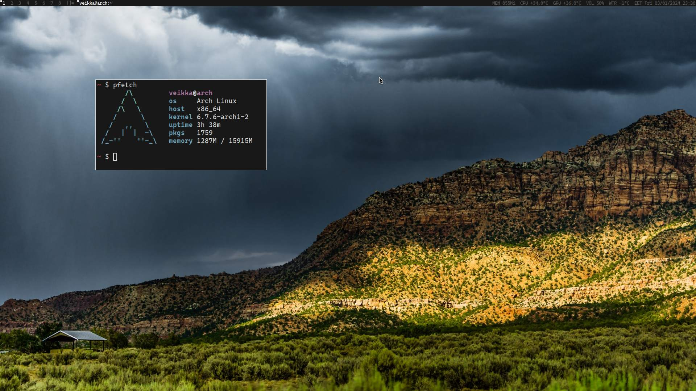

# dwm-imveikka

 

dwm is an extremely fast, small, and dynamic window manager for X, created
by great people from [suckless.org](suckless.org).

This is my configuration of dwm using handful of patches.

## Requirements

In order to build dwm you need the Xlib header files.

And then there are "requirements":

- Firefox (browser)
- Alacritty (terminal)
- alsa-utils (volume control using keyboard)
- CaskaydiaCove Nerd Font,
- dmenu

which can be modified to own liking from `config.h`.

## Current patches

- push
- alwayscenter

## Installation

Enter the following command to build and install dwm (if
necessary as root):

```
make clean install
```

## Running dwm (without login manager)

Add the following line to your .xinitrc to start dwm using startx:

```
exec dwm
```

## Configuration

The configuration of dwm is done by creating a custom config.h
and (re)compiling the source code.

## Miscellaneous

- official site: [https://dwm.suckless.org/](https://dwm.suckless.org/)
